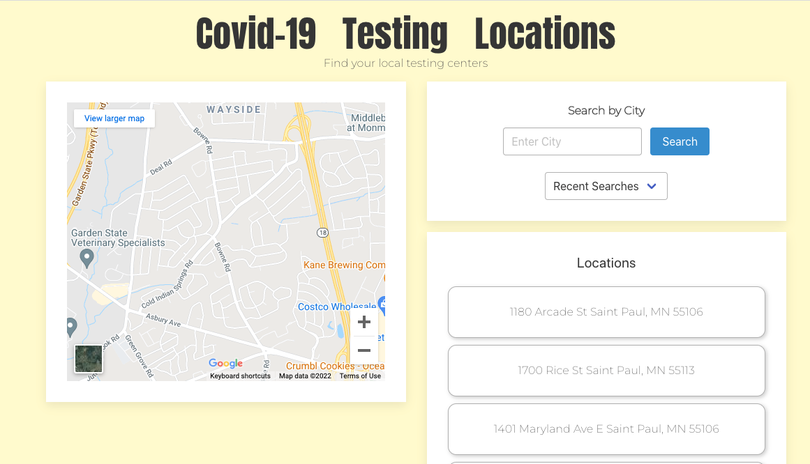

# covid-testing-locations

## Synopsis:

This project is to help anyone with COVID-19 symptoms find COVID-19 testing locations in the city specified by the user.
The application is limited to cities in the United States.
The user will be able to use the input form on the application to search for COVID-19 testing locations in the specified city.
The application will then display to the user the locations found.
The search results will also display the addresses of the locations found.
The search result will also present the user with a map to give the user a visual of where the locations are situated.

## Purpose:

To build an interactive front-end project with the University of MN coding bootcamp.

## User Story:

As someone in the United States
I want to see COVID-19 testing locations
so that I can be tested for COVID-19.

## Project requirements:

- Use a CSS framework other than Bootstrap.
- Be deployed to GitHub Pages.
- Be interactive (i.e., accept and respond to user input).
- Use at least two server-side APIs.
- Does not use alerts, confirms, or prompts (use modals).
- Use client-side storage to store persistent data.
- Be responsive.
- Have a polished UI.
- Have a clean repository that meets quality coding standards (file structure, naming conventions, follows best practices for class/id naming conventions, indentation, quality comments, etc.).
- Have a quality README (with unique name, description, technologies used, screenshot, and link to deployed application)
- Add project to the portfolio that you created in Module 2.

## Link to Deployed page:

https://saraoros.github.io/covid-testing-locations/

## Link to Repo:

https://github.com/saraoros/covid-testing-locations

## APIs used

- Google Maps:
  https://developers.google.com/maps/documentation/javascript/overview

- Here:
  https://developer.here.com/

- Open Weather:
  https://openweathermap.org/api/one-call-api

## CSS Framework used

- UIKit:
  https://getuikit.com/

## Screenshots:

